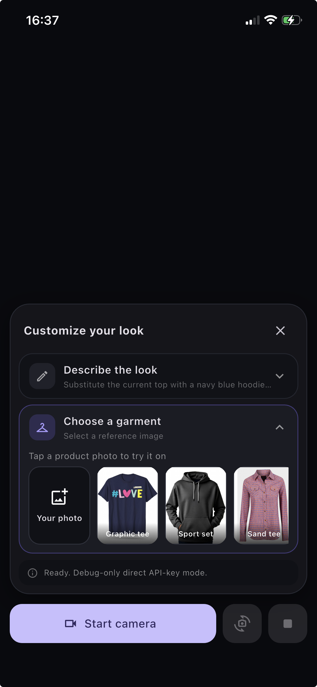

[](https://pub.dev/packages/decart_vton_flutter)
[](https://github.com/Emmanueloluwadamilola/decart-flutter-sdk/actions/workflows/ci.yml)
[](https://github.com/Emmanueloluwadamilola/decart-flutter-sdk/blob/master/LICENSE)

Realtime virtual try-on for Flutter, backed by Decart's native Lucy VTON SDKs.
Stream the device camera as WebRTC video for AR try-on, clothes try-on, and live
outfit-swap experiences in fashion apps, then update outfits with text, a garment
image, or both.

This is an independent Flutter wrapper and is not an official Decart package.

## Contents

- [Features](#features)
- [Architecture](#architecture)
- [Requirements](#requirements)
- [Installation](#installation)
- [Quick start](#quick-start)
- [Authentication](#authentication)
- [API summary](#api-summary)
- [Error handling](#error-handling)
- [Privacy and security](#privacy-and-security)
- [Limitations](#limitations)

## Demo



## Features

- Android and iOS native video rendering.
- VTON 3.5 / `lucy-vton-latest` at its native 1280x720 geometry.
- Live prompt and JPEG, PNG or WebP garment updates without reconnecting.
- In-session front/back camera switching without creating a new Decart session.
- Typed connection state, quality, events and errors.
- Serialized lifecycle operations that cannot tear down one another.
- Background disconnect and foreground recovery via `VtonLifecycleObserver`.
- Production client-token provider API, plus an explicitly debug-only direct
  test-key initializer.
- STUN connectivity preflight with `checkConnectivity()`.

The package provides one Dart API across Android and iOS, with unified
authentication and lifecycle management through `VtonLifecycleObserver` rather
than requiring each host app to build and maintain its own platform-channel bridge.

## Architecture

Flutter sends lifecycle and outfit commands through platform channels while
Decart's native SDKs keep camera capture, LiveKit/WebRTC transport, and video
rendering native. See the
[architecture overview](https://github.com/Emmanueloluwadamilola/decart-flutter-sdk/blob/master/docs/architecture.md)
for the complete end-to-end flow and platform responsibilities.

## Requirements

| Platform | Minimum | Native SDK |
| --- | --- | --- |
| Flutter | 3.44.0 | Dart 3.12.0 |
| Android | API 24, Java 17, AGP 9 | `decart-android` 0.7.10 |
| iOS | iOS 17, Xcode 16+, Swift Package Manager | `decart-ios` 0.6.10 |

| Platform | Supported |
| --- | --- |
| Android | ✅ |
| iOS | ✅ |
| Web | ❌ |
| macOS | ❌ |
| Windows | ❌ |
| Linux | ❌ |

Web, macOS, Windows and Linux are not supported because Decart does not provide
realtime native SDKs for those platforms.

## Installation

```yaml
dependencies:
  decart_vton_flutter: ^1.0.0
```

Then run:

```bash
flutter pub get
```

### Android setup

The Decart Android SDK is distributed through JitPack. Add JitPack to the host
app's root `android/build.gradle.kts`:

```kotlin
allprojects {
    repositories {
        google()
        mavenCentral()
        maven { url = uri("https://jitpack.io") }
    }
}
```

Use `minSdk = 24`, Java 17 and AGP 9. The package uses AGP's built-in Kotlin
support and requires Flutter 3.44 or newer. `CAMERA`, `INTERNET` and
`ACCESS_NETWORK_STATE` merge from the plugin manifest; request camera permission
in your app before `connect()`.

### iOS setup

Enable Flutter Swift Package Manager integration:

```bash
flutter config --enable-swift-package-manager
```

Set the deployment target to iOS 17 and add usage descriptions:

```xml
<key>NSCameraUsageDescription</key>
<string>Used to show you wearing different outfits in real time.</string>
<key>NSPhotoLibraryUsageDescription</key>
<string>Used to select a garment reference image.</string>
```

Camera sessions require a physical iOS device.

## Quick start

```dart
import 'package:decart_vton_flutter/decart_vton_flutter.dart';
import 'package:flutter/material.dart';

class TryOnView extends StatefulWidget {
  const TryOnView({super.key});

  @override
  State<TryOnView> createState() => _TryOnViewState();
}

class _TryOnViewState extends State<TryOnView> {
  final vton = DecartVton();
  late final VtonLifecycleObserver lifecycle;

  @override
  void initState() {
    super.initState();
    lifecycle = VtonLifecycleObserver(
      onError: (error) => debugPrint('$error'),
    )..attach();
  }

  Future<void> start() async {
    // Request camera permission in your app before this call.
    await vton.initialize(clientTokenProvider: fetchClientToken);
    await vton.connect(
      model: VtonModel.lucyVtonLatest,
      // VTON 3.5 uses exactly 1280x720 at 30 fps; 1080p is rejected.
      resolution: VtonResolution.p720,
      initialOutfit: const VtonOutfit(
        prompt: 'Substitute the current top with a navy blue hoodie',
      ),
    );
  }

  @override
  void dispose() {
    lifecycle.detach();
    vton.dispose();
    super.dispose();
  }

  @override
  Widget build(BuildContext context) => const VtonRemoteView(
        fit: VtonVideoFit.cover,
      );
}
```

Apply a complete outfit state:

```dart
await vton.setOutfit(
  prompt: 'Substitute the current top with this jacket, worn open',
  referenceImage: garmentJpegBytes,
  enhance: false,
);
```

If the picker already returned a local file, prefer the file-backed form. It
keeps the full image out of Dart memory and the platform channel:

```dart
await vton.setOutfit(
  prompt: 'Substitute the current top with this jacket, worn open',
  referenceImagePath: pickedImage.path,
);
```

Every update replaces the complete server-side state. To retain the current
garment while changing the text:

```dart
await vton.setOutfit(
  outfit: vton.currentOutfit!.copyWith(prompt: 'Make the jacket charcoal grey'),
);
```

Reference images can be supplied as bytes or an absolute local file path. They
must contain valid JPEG, PNG or WebP data and be no larger than 5 MB. Keep a
file-backed image available while its outfit may be restored after an app
lifecycle interruption. Clean garment-only images on plain backgrounds, at
least 512x512, produce the best results.

## Authentication

Use developer-configured authentication: your users should never be asked to
paste a Decart key, client token, or endpoint into the app.

In production, your permanent `dct_` credential belongs only on your backend.
The mobile app calls an authenticated HTTPS route that you own, and that route
creates and returns a short-lived Decart client token (`ek_...`). This gives
users the same frictionless experience as other mobile SDKs configured by the
developer, without embedding a permanent credential in the APK or IPA.

The recommended flow is:

1. The signed-in app sends `POST /decart/client-token` to your backend.
2. Your backend authenticates the user, rate-limits the request, and uses its
   server-side `dct_` credential to create a short-lived client token.
3. The backend responds with Decart's documented JSON shape:
   `{"apiKey":"ek_...","expiresAt":"..."}`.
4. The app returns `apiKey` from its `clientTokenProvider`; the package uses it
   for the connection and does not persist it.

This is the same security shape used by Agora's RTC tokens and Paystack's
transaction access codes:

| Mobile application receives | Backend keeps permanently |
| --- | --- |
| Public HTTPS token-endpoint URL | Decart `dct_...` API key |
| Fresh, short-lived `ek_...` token | Token-minting authority |

Decart does not currently provide a permanent publishable mobile key comparable
to a Stripe or Paystack `pk_...` key. The production initializer therefore
accepts a `VtonClientTokenProvider` callback rather than a raw API key. This lets
the host app use its existing HTTP client, login session, certificate pinning,
retry policy, and authorization headers when calling its backend.

Use your app's existing authenticated API client for the provider:

```dart
Future<String> fetchClientToken() async {
  final response = await yourAuthenticatedApi.post('/decart/client-token');
  final token = response.json['apiKey'];
  if (token is! String || token.isEmpty) {
    throw StateError('The backend did not return a client token.');
  }
  return token;
}

await DecartVton().initialize(
  clientTokenProvider: fetchClientToken,
);
```

A minimal Next.js token route looks like this. Add your application's user
authentication and rate limiting before deploying it:

```typescript
import { createDecartClient } from '@decartai/sdk';

const decart = createDecartClient({
  apiKey: process.env.DECART_API_KEY, // dct_...; server environment only
});

export async function POST(request: Request) {
  await authenticateYourUser(request);
  const token = await decart.tokens.create({ expiresIn: 60 });
  return Response.json(token); // { apiKey: 'ek_...', expiresAt: '...' }
}
```

The provider is called when the native client needs a fresh credential. The
client created by `initialize()` is reused for the first connection; later new
connections and lifecycle restoration request another token. In-session camera
switches keep the existing native client and session.
If the initial token expires before use, the first connection refreshes it and
retries once. Do not cache the token in preferences, print it, or send a `dct_`
credential from the production app. The production initializer accepts only
`ek_...` client tokens; permanent and unrecognized credentials fail before
crossing the platform channel. See
Decart's [client-token documentation](https://docs.platform.decart.ai/getting-started/client-tokens)
for the backend token-creation request.

### Local testing and prototypes

For the fastest local setup, a Flutter **debug build only** can initialize with
a permanent test API key:

```dart
// Local debug only. Never commit a real key.
const developmentApiKey = 'dct_your_temporary_test_key';

await DecartVton().initializeForDevelopment(
  apiKey: developmentApiKey,
);
```

`initializeForDevelopment` throws in profile and release builds. This is an
intentional safety boundary, not an obfuscation feature: the key is still
compiled into the debug application and can be extracted. Use a separate test
key, paste it only for the local run, remove it immediately afterwards, never
commit it, never distribute the build, and rotate it after shared testing. Do
not use this method in an app-store build or production application.

Before production, replace it with `initialize(clientTokenProvider: ...)` and
follow Decart's official
[guide to creating client tokens](https://docs.platform.decart.ai/getting-started/client-tokens).

### Run the bundled example

The example supports both modes without showing any credential field to users.
For production, its `.env` supplies only the public token-endpoint URL as a
compile-time define rather than bundling the file as a Flutter asset.

From the package root:

```bash
cp -n example/env.example example/.env
```

For production, edit `example/.env` and enable:

```bash
DECART_TOKEN_ENDPOINT=https://your-backend.com/decart/client-token
```

For a local debug prototype instead, leave the endpoint unset and edit the
constant near the top of `example/lib/main.dart`:

```dart
const String _developmentApiKey = 'dct_your_temporary_test_key';
```

Configure only one mode. The helper and example reject mixed configuration so a
permanent key cannot accidentally ride along in a token-endpoint build.

Then launch it:

```bash
tool/run_example.sh
```

The helper loads `example/.env` when it contains a production endpoint;
otherwise it starts the debug example with the in-code development constant.
Any normal `flutter run` arguments can follow it, for example
`tool/run_example.sh -d <device-id>`.

For Windows or without the helper, run `flutter run` inside `example/`. Add the
define file only when using the production token endpoint:

```bash
# In-code debug key:
flutter run

# Production token endpoint:
flutter run --dart-define-from-file=.env
```

`example/.env` is git-ignored. If neither mode is configured, the example
displays a developer-configuration message; it never displays a credential
input to the end user.

## API summary

| Member | Purpose |
| --- | --- |
| `initialize(clientTokenProvider: ...)` | Configures authentication and native clients. |
| `initializeForDevelopment(apiKey: ...)` | Debug-build-only direct key setup for local testing. |
| `connect(...)` | Opens a camera/VTON session. |
| `setOutfit(...)` | Atomically replaces the outfit state using a prompt, image bytes, or a native file path. |
| `switchCamera()` | Switches the published camera track in place; the session ID and outfit remain unchanged. |
| `checkConnectivity()` | Tests whether the network supports realtime media. |
| `disconnect()` | Releases the session and camera. |
| `resumeLastSession()` | Restores the complete prior configuration with a fresh token. |
| `dispose()` | Releases all native and Dart resources. |

`events`, `connectionStates` and `errors` are broadcast streams. Synchronous
state is available through `connectionState`, `isConnected`, `isInitialized`,
`model`, `cameraFacing`, `sessionId` and `currentOutfit`.

## Error handling

Listen to the `errors` broadcast stream to react to non-fatal problems reported
mid-session. Native SDK and plugin-domain failures are thrown by the method that
caused them as `DecartVtonException` values. Local API misuse can throw
`ArgumentError`, while invalid lifecycle or widget state can throw `StateError`.

```dart
vton.errors.listen((error) {
  // handle error
});
```

Common causes:

- **Auth failure (`invalidApiKey`)** — the client token is missing, malformed,
  expired, or rejected; mint a fresh `ek_...` token from your backend.
- **Camera permission denied (`permissionDenied`)** — request permission before
  calling `connect()`.
- **Connectivity failure (`webrtc`)** — use `checkConnectivity()` before
  connecting on restrictive networks.
- **Invalid garment image (`invalidInput`)** — byte and file-backed images are
  validated for type (JPEG/PNG/WebP) and size (5 MB max). File-backed input
  sends only its path through the platform channel.

## Privacy and security

This package transmits live camera video, prompts and optional garment images to
Decart to provide the requested transformation. It does not persist media or
tokens itself. Host apps remain responsible for:

- obtaining informed camera/photo-library permission;
- displaying an accurate privacy notice before capture;
- authenticating their token endpoint and rate-limiting token issuance;
- using HTTPS and never logging client tokens;
- documenting Decart as a service provider and completing applicable app-store
  privacy/data-safety disclosures;
- reviewing Decart's current terms, privacy policy, retention commitments and
  data-processing agreement for their jurisdiction.

See [SECURITY.md](https://github.com/Emmanueloluwadamilola/decart-flutter-sdk/blob/master/SECURITY.md)
for vulnerability reporting and
[PRIVACY.md](https://github.com/Emmanueloluwadamilola/decart-flutter-sdk/blob/master/PRIVACY.md)
for integration guidance.

## Limitations

- iOS requires Swift Package Manager and iOS 17.
- Camera switching briefly interrupts local capture while the other lens opens,
  but preserves the Decart session and session ID.
- Audio and batch/queue APIs are not exposed.
- Android uses hybrid composition for reliable native rendering. Avoid animating
  large translucent Flutter layers over the video on low-end devices.
- Camera capture is unavailable in the iOS Simulator.

See [CONTRIBUTING.md](https://github.com/Emmanueloluwadamilola/decart-flutter-sdk/blob/master/CONTRIBUTING.md).
Full API reference:
https://pub.dev/documentation/decart_vton_flutter/latest/. Report issues at the
[GitHub issue tracker](https://github.com/Emmanueloluwadamilola/decart-flutter-sdk/issues).

## License

MIT — see [LICENSE](https://github.com/Emmanueloluwadamilola/decart-flutter-sdk/blob/master/LICENSE).
Decart, Lucy and the Decart SDKs are the property
of Decart AI; use of the service is governed by Decart's terms.
